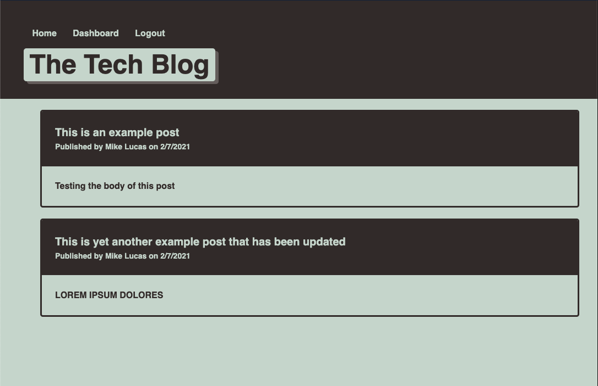

# Tech Blog 

## Description
Tech Blog is the destination for all things tech! Join a tech-minded community where you can share your thoughts, ideas, and questions about tech and the tech industry. 

## Table of Contents
- [Installation](#Installation)
- [Usage](#Usage)
- [License](#License)

## Installation
No need to install, simply visit https://clu-codes-tech-blog.herokuapp.com/ ! 

## Usage
Tech Blog is a community for those passionate about tech. Curious about the latest advancements? Write a blog post to see if anyone has valuable information. With Tech Blog, anyone can post, edit, and comment their ideas with the world!

## License
This application is under the MIT license.

## Image

## Questions
Github: https://www.github.com/clu-codes
If you have additional questions, please feel free to reach out to me at Please contact me via linkedIn at Connor Cluster.
